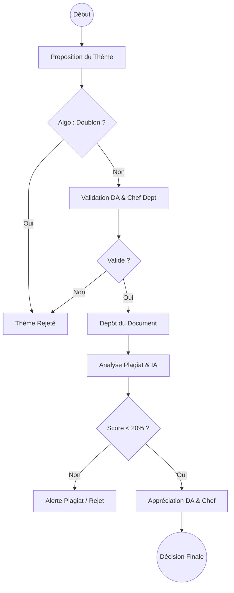

# Workflows Détaillés - Handal

> [!IMPORTANT]
> **État d'implémentation — Version 2.0 (Cible)**
> Ce document décrit le **workflow cible** complet de la plateforme. Certaines fonctionnalités sont déjà implémentées (Phases 0–6), d'autres sont planifiées (Phase 7+).
>
> | Légende       | Signification                                     |
> | ------------- | ------------------------------------------------- |
> | ✅ Implémenté | Route/fonctionnalité présente dans le code actuel |
> | 🔲 Planifié   | Documenté ici comme cible — pas encore codé       |
>
> **Modèle actuellement en production :** validation séquentielle (PENDING → VALIDATED_CD → VALIDATED_DA).
> **Modèle cible documenté ici :** validation simultanée conjointe (TEACHER + DA en parallèle).

Ce document décrit le workflow complet de chaque rôle utilisateur dans la plateforme Handal, avec tous les états, conditions et actions possibles.

---

## 0. SYSTÈME DE FILTRAGE INTELLIGENT (Vue d'Ensemble)

### Architecture Générale

Le workflow Handal s'articule autour de **trois phases critiques** avec filtrage progressif:

#### Phase 1: Le Thème (Double Barrière)

- **Objectif:** Éviter les sujets redondants ou déjà traités
- **Étapes:**
  1. **Proposition (Étudiant):** Soumission titre + description
  2. **Auto-Vérification Algorithmique:** Comparaison instantanée avec tous les mémoires existants
  3. **Validation Administrative Simultanée:** Chef de département + Direction Académique (DA)

#### Phase 2: Le Document (Analyse Technique)

- **Objectif:** Évaluer la qualité pédagogique et l'intégrité académique
- **Étapes:**
  1. **Dépôt du Document:** Téléversement du fichier final (thème VALIDATED uniquement)
  2. **Analyse Profonde:** Détection plagiat sémantique + analyse motifs IA

#### Phase 3: Le Verdict (Appréciation Finale avec Seuil 20%)

- **Objectif:** Décision automatique + humaine sur l'admissibilité
- **Étapes:**
  1. **Filtre Automatique 20%:** Score < 20% = "propre", Score ≥ 20% = alerte/rejet
  2. **Appréciation Humaine:** Chef de département + DA consultent rapport détaillé
  3. **Décision Finale:** Soutenance autorisée, mention, ou sanction

### Diagramme Global



### Tableau Comparatif: Ancien vs Nouveau Workflow

| Étape                   | Ancien Workflow                | Nouveau Workflow                                  |
| ----------------------- | ------------------------------ | ------------------------------------------------- |
| **Vérification Thème**  | Unicité du titre uniquement    | Comparaison algorithmique avec historique complet |
| **Séquence Validation** | Teacher d'abord, puis DA       | Envoi conjoint à DA & Chef de département         |
| **Note/Score**          | Assignée par DA lors du thème  | Remplacée par appréciation finale après analyse   |
| **Critère de Passage**  | Aucun seuil automatique        | Seuil strict de 20% de similarité                 |
| **Analyse Document**    | Auto-test + analyse officielle | Plagiat sémantique + détection IA                 |
| **Décision Finale**     | Délibération DA seule          | Appréciation conjointe Chef + DA                  |

---

## 1. WORKFLOW ÉTUDIANT (STUDENT)

### 1.1 Authentification & Accès

**Point d'entrée:** Page d'accueil `/`

- L'étudiant saisit son **INE** (Identifiant National Étudiant) et son mot de passe
- Le système valide les identifiants via `/api/login`
- Redirection vers `/student` (tableau de bord étudiant)
- La session est stockée localement

**Comptes de démo:**

- INE: `N01331820231`
- Mot de passe: `mon926732`

**Permissions:**

- Accès exclusif à `/student`
- Peut consulter son profil et ses propres thèmes/documents

---

### 1.2 Proposition de Thème (Phase 1, Étape 1)

**Endpoint:** `POST /api/themes/propose`

**Conditions préalables:**

- Étudiant authentifié
- N'a pas encore de thème approuvé (implicite: un thème actif par étudiant)

**Données requises:**

```json
{
  "title": "Détection de plagiat multilingue par NLP",
  "description": "Évaluation des approches sémantiques et traduction inverse pour détecter le plagiat cross-lingue."
}
```

**Validations (Client):**

- `title` minimum 8 caractères
- `description` minimum 1 caractère

**Validations (Serveur):**

1. **Validation Format:**
   - `title` minimum 8 caractères
   - `description` minimum 1 caractère

2. **Auto-Vérification Algorithmique (NOUVEAU):**
   - Comparaison sémantique du titre et description avec **tous les mémoires existants** (validés ou archivés)
   - Utilisation de similarité cosinus ou fuzzy matching pour détecter les doublons
   - Seuil de similarité: ≥ 70% = rejet automatique avec message explicite
   - Stockage de la similarité détectée pour audit

**Résultat en cas de succès (Auto-Check PASSED):**

- Thème créé avec statut `PENDING_VALIDATION`
- Réponse: `{ theme: { id: "12", status: "PENDING_VALIDATION", algorithmicCheckPassed: true } }`
- **Envoi SIMULTANÉ** aux Chef de département (TEACHER) et Direction Académique (DA)
- Notification: "Nouveau thème en attente de validation"

**Résultat en cas d'échec (Auto-Check FAILED):**

- Code 409: Doublon détecté
- Réponse: `{ error: "Thème trop similaire aux suivants: #5 (87%), #12 (75%)", similarityMatches: [...] }`
- Le thème est **REJETÉ automatiquement**
- Suggestion: L'étudiant peut reformuler et renvoyer

**Résultat en cas d'erreur de validation:**

- Code 400: titre trop court, description manquante
- Code 422: validation schema échouée

**État du thème:**

```
PENDING_VALIDATION ← Créé après auto-check algorithmique OK
                     (attend validation SIMULTANÉE par TEACHER & DA)
```

**UI/UX:**

- Formulaire "Proposer un thème" dans le tableau de bord
- Champs: titre, description
- Lors de la soumission:
  - Affichage "Vérification en cours..."
  - Si doublon détecté: `"Votre thème est trop similaire aux thèmes #5 (87%) et #12 (75%). Veuillez le reformuler."`
  - Si accepté: `"Thème créé #12. En attente de validation da la Commission."`
- Permet de proposer plusieurs thèmes (mais un seul peut être actif)

---

### 1.3 Suivi des Thèmes

**Endpoint:** `GET /api/me/overview`

L'étudiant voit:

- Son profil: nom, rôle, INE, identifiant
- État de son thème actuel (si proposé)
- Ses documents (si thème validé)

**États du thème visibles:**

1. **PENDING_VALIDATION** → En attente de validation conjointe (Chef de département + DA)
2. **REJECTED** → Rejeté (automatiquement par algo OU par humains), ne peut pas déposer
3. **VALIDATED** → Approuvé par Chef + DA conjointement, **peut maintenant déposer le mémoire**
4. **DOCUMENT_SUBMITTED** → Mémoire uploadé, en attente d'analyse
5. **ANALYSIS_PENDING** → Document analysé, en attente d'appréciation finale
6. **APPROVED** → Appréciation finale positive, soutenance autorisée
7. **FLAGGED_PLAGIARISM** → Alerte plagiat (score ≥ 20%), en révision

**Actions disponibles selon l'état:**

- **PENDING_VALIDATION:** Attendre validation
- **REJECTED:** Attendre (doublon détecté) ou proposer nouveau thème
- **VALIDATED:** Déposer le mémoire final (voir section 1.4)
- **DOCUMENT_SUBMITTED/ANALYSIS_PENDING:** Attendre appréciation
- **APPROVED:** Accès aux rapports finaux
- **FLAGGED_PLAGIARISM:** Révision/correction nécessaire

---

### 1.4 Dépôt du Mémoire Final (Phase 2, Étape 1)

**Endpoint:** `POST /api/documents/upload-file` (multipart/form-data)

**Conditions préalables (STRICTES):**

1. Étudiant authentifié
2. Thème appartient à l'étudiant
3. Thème a le statut `VALIDATED` (approuvé par Chef + DA)

**Données requises:**

```
Multipart Form:
- file: [binary PDF/DOCX file]
```

**Validations:**

- Fichier présent (`file` requis)
- Étudiant doit avoir un thème avec statut `VALIDATED` (retrouvé automatiquement)
- Type MIME accepté: `application/pdf` ou `application/vnd.openxmlformats-officedocument.wordprocessingml.document`
- Taille fichier ≤ 50MB
- Calcul SHA-256 checksum automatique

**Traitement interne:**

1. Authentification de l'étudiant
2. Récupération du thème VALIDATED lié à cet étudiant
3. Validation du fichier
4. Calcul du checksum SHA-256
5. Création d'un enregistrement `document` en base avec:
   - `theme_id` (retrouvé automatiquement)
   - `student_id` (de l'authentification)
   - `original_name` (nom du fichier)
   - `mime_type`
   - `file_size`
   - `checksum` (sha256:...)
   - `is_final: true`
   - `submitted_at: NOW()`
   - **`status = "SUBMITTED"`**

**Résultat en cas de succès:**

- Code 201
- Réponse: `{ ok: true, document: { id: "25", status: "SUBMITTED" } }`
- Message UI: `"Document uploadé: 25. Analyse Plagiat + IA en cours..."`
- **Lancement automatique de la Phase 2 (Analyse Technique)**
- L'analyseprend environ 24h (simulé : immédiat en développement)

**Résultat en cas d'échec:**

- Code 400: fichier invalide, format non supporté, trop volumineux
- Code 401: étudiant non authentifié
- Code 403: étudiant n'a pas de thème VALIDATED
- Code 422: validation schema échouée

**État du document:**

```
SUBMITTED ← Document uploadé
  ↓
Analyse Profonde Automatisée (Plagiat + Détection IA)
  ↓
ANALYSIS_COMPLETE ← Scores générés, rapport créé
```

**UI/UX:**

- Zone de dépôt avec drag-and-drop (SEUL champ)
- Affichage du thème lié (lecture seule): `"Thème: [titre du thème VALIDATED]"`
- Message de validation du fichier avant upload
- Affichage de la progression d'upload
- Message de succès: `"Votre document a été uploadé. Analyse en cours. Résultats disponibles dans 24h."`
- Liste des documents récents avec statut et progression d'analyse

---

### 1.5 Analyse Profonde du Document (Phase 2, Étape 2)

**Processus Automatique Lancé à la Soumission**

Cette étape s'exécute **automatiquement** après le dépôt du document (section 1.4).

**Analyses Effectuées:**

#### 1. Détection Plagiat Sémantique

- **Comparaison:** Document vs. tous les mémoires stockés + sources web
- **Méthode:** Similarité cosinus sur embeddings sémantiques
- **Résultat:** Score de similarité (0-100%)
- **Sortie:**
  - `plagiarism_score`: Pourcentage (ex: 15%)
  - `matched_sources`: Liste des documents/sources similaires
  - `highlighted_segments`: Passages suspects avec offset

#### 2. Détection d'Automatisation (IA)

- **Détection:** Analyse des motifs linguistiques pour identifier génération IA
- **Méthode:** Machine learning sur patterns textuels (répétitions, structure, vocabulaire)
- **Résultat:** Score de probabilité IA (0-100%)
- **Sortie:**
  - `ai_detection_score`: Pourcentage (ex: 8%)
  - `ai_probability`: `low` / `medium` / `high`
  - `risk_indicators`: Zones de texte suspectes

**Résultat Complet:** 🔲 Planifié — structure JSON cible

```json
{
  "document_id": "25",
  "analysis_type": "DEEP_ANALYSIS",
  "plagiarism_score": 15,
  "ai_detection_score": 8,
  "combined_risk_score": 22,
  "risk_level": "MEDIUM",
  "matched_sources": [
    { "id": "10", "title": "...", "similarity": 0.73 },
    { "id": "35", "title": "...", "similarity": 0.68 }
  ],
  "ai_indicators": [
    { "type": "repetition_pattern", "severity": "low" },
    { "type": "formal_structure", "severity": "medium" }
  ],
  "analyzed_at": "2026-04-19T14:30:00Z",
  "status": "ANALYSIS_COMPLETE"
}
```

**État du Document:**

```
SUBMITTED (document reçu)
  ↓
ANALYSIS_IN_PROGRESS (analyse sémantique + IA)
  ↓
ANALYSIS_COMPLETE (scores générés)
  ↓
→ Phase 3 : Application du Seuil 20% (voir section 1.6)
```

**Endpoint cible (Étudiant):** `GET /api/documents/{id}/analysis` 🔲 Planifié — non implémenté

L'étudiant pourra consulter les scores (read-only après génération).

---

### 1.6 Phase 3: Le Verdict - Application du Seuil 20%

**Filtre Automatique (Seuil 20%)**

Une fois l'analyse complète, le système applique un **seuil strict** sur le score plagiat combiné:

```
SI plagiarism_score + (ai_detection_score * 0.5) < 20%:
    → FLAGGED = false (Document "propre")
    → État: CLEAN
    → Peut avancer vers appréciation humaine

SINON:
    → FLAGGED = true (Alerte plagiat)
    → État: FLAGGED_PLAGIARISM
    → Demande révision/correction
    → Étudiant reçoit notification
```

**Cas d'Usage 1: Score < 20% (Document Propre)**

- Le document passe le filtre automatique
- État du document: `CLEAN`
- État du thème: `ANALYSIS_PENDING` (en attente d'appréciation humaine)
- Notification à l'étudiant: `"Votre document a passé la vérification d'intégrité. En attente d'appréciation de la commission."`
- **Passage à l'Appréciation Humaine** (voir section 1.7)

**Cas d'Usage 2: Score ≥ 20% (Alerte Plagiat)**

- Le document est automatiquement **REJETÉ** ou **FLAGGED** pour révision
- État du document: `FLAGGED_PLAGIARISM`
- État du thème: `FLAGGED_PLAGIARISM`
- Notification à l'étudiant: `"ALERTE: Votre document contient {score}% de contenu similaire/automatisé. Révision requise. Dépôt d'une nouvelle version possible."`
- Options pour l'étudiant:
  - ✅ Déposer une nouvelle version corrigée
  - ✅ Contester le résultat (escalade vers Chef + DA pour révision manuelle)

**Endpoint:** Phase automatique, pas d'endpoint direct

---

### 1.7 Appréciation Humaine Finale (Phase 3, Étape 2)

**Conditions Préalables:**

1. Document en état `CLEAN` (score < 20%)
2. Analyse complète disponible
3. Chef de département ET Direction Académique consultent le rapport

**Processus Collaboratif:**

1. **Chef de Département (TEACHER) consulte:**
   - Rapport d'analyse complète
   - Segments surlignés
   - Scores plagiat + IA
   - Historique du thème

2. **Direction Académique (DA) consulte:**
   - Mêmes informations
   - Décisions antérieures (si révisions)

3. **Appréciation Conjointe:**
   - Discussion via commentaires sur le rapport (optionnel)
   - Validation indépendante ou concertée
   - Enregistrement de la décision finale

**Décisions Possibles:**

| Décision                | Description                                                         |
| ----------------------- | ------------------------------------------------------------------- |
| `APPROVED`              | Document accepté, soutenance autorisée                              |
| `APPROVED_WITH_MENTION` | Accepté avec distinction (Très Bien, Bien, etc.)                    |
| `CONDITIONAL_APPROVAL`  | Accepté sous conditions (corrections mineures, commentaires)        |
| `REQUESTED_REVIEW`      | Demande révision plus profonde (plagiat suspect malgré score < 20%) |
| `REJECTED`              | Rejeté (qualité insuffisante, intégrité compromise)                 |

**Endpoint cible:** `POST /api/documents/{id}/final-appreciation` 🔲 Planifié — non implémenté

```json
{
  "decision": "APPROVED",
  "teacher_comment": "Travail de qualité, méthodologie rigoureuse.",
  "da_comment": "Conforme aux standards académiques. Approuvé.",
  "mention": "BIEN",
  "conditions": null
}
```

**Résultat:**

- Réponse: `{ ok: true, document: { id: "25", status: "APPROVED" } }`
- États finaux:
  - Document: `APPROVED` / `APPROVED_WITH_MENTION` / `CONDITIONAL_APPROVAL` / `REQUESTED_REVIEW` / `REJECTED`
  - Thème: `APPROVED` / `APPROVED_WITH_MENTION` / etc.
- Notification à l'étudiant: `"Appréciation finale reçue: APPROVED. Soutenance autorisée le [DATE]."`

**UI/UX:**

- Panneau "Appréciation Finale" visible pour TEACHER + DA
- Affichage du rapport complet
- Champs de commentaire pour chaque rôle
- Dropdown pour décision finale
- Historique des commentaires antérieurs (si révisions)

---

### 1.8 Workflow Complet Étudiant (Diagramme - Nouveau Système 3 Phases)

```
┌─────────────────────────────────────────────────────────────────┐
│ PHASE 0: AUTHENTIFICATION                                       │
│    ├─ INE + mot de passe                                         │
│    └─ Redirection → /student                                     │
└─────────────────────────────────────────────────────────────────┘
                              ↓
┌─────────────────────────────────────────────────────────────────┐
│ PHASE 1: LE THÈME (Double Barrière)                             │
│ ┌─────────────────────────────────────────────────────────────┐ │
│ │ Étape 1: Proposition + Auto-Check Algorithmique            │ │
│ │ POST /api/themes/propose {title, description}              │ │
│ │   ↓ Vérification automatique vs historique (70% seuil)     │ │
│ │   ↓ SI doublon: REJECTED automatiquement                   │ │
│ │   ↓ SI OK: Thème PENDING_VALIDATION                        │ │
│ └─────────────────────────────────────────────────────────────┘ │
│              ↓                                   ↓              │
│     ┌────────────────┐                ┌──────────────────┐      │
│     ↓ AUTO-REJECTED  ↓                ↓ AUTO-APPROVED    ↓      │
│   REJECTED        Étape 2: Validation Simultanée           │
│  (Fin)         Chef Département + DA                      │
│                                       ↓                    │
│                   ┌──────────────────┴──────────────────┐  │
│                   ↓                                     ↓  │
│              REJETÉ par commission          APPROUVÉ par commission
│                   │                                     │  │
│                   └──REJECTED                  VALIDATED──┘ │
│                      (Fin)                   (peut déposer)
└─────────────────────────────────────────────────────────────────┘
                              ↓
┌─────────────────────────────────────────────────────────────────┐
│ PHASE 2: LE DOCUMENT (Analyse Technique)                        │
│ ┌─────────────────────────────────────────────────────────────┐ │
│ │ Étape 1: Dépôt du Mémoire                                  │ │
│ │ POST /api/documents/upload-file                            │ │
│ │ → Conditions: thème = VALIDATED                            │ │
│ │ → État document: SUBMITTED                                 │ │
│ └─────────────────────────────────────────────────────────────┘ │
│              ↓                                                   │
│ ┌─────────────────────────────────────────────────────────────┐ │
│ │ Étape 2: Analyse Profonde (Automatique)                    │ │
│ │ • Détection Plagiat Sémantique (0-100%)                    │ │
│ │ • Détection IA Automatisée (0-100%)                        │ │
│ │ → État document: ANALYSIS_COMPLETE                         │ │
│ └─────────────────────────────────────────────────────────────┘ │
└─────────────────────────────────────────────────────────────────┘
                              ↓
┌─────────────────────────────────────────────────────────────────┐
│ PHASE 3: LE VERDICT (Appréciation Finale)                       │
│ ┌─────────────────────────────────────────────────────────────┐ │
│ │ Étape 1: Filtre Automatique 20%                            │ │
│ │ IF score_plagiat + (score_ia * 0.5) < 20%:                │ │
│ │    → État: CLEAN                                           │ │
│ │ ELSE:                                                      │ │
│ │    → État: FLAGGED_PLAGIARISM                             │ │
│ │    → Notification étudiant + option révision              │ │
│ └─────────────────────────────────────────────────────────────┘ │
│              ↓                                   ↓              │
│     ┌────────────────┐                ┌──────────────────┐      │
│     ↓ FLAGGED        ↓                ↓ CLEAN            ↓      │
│  PLAGIARISM       Étape 2: Appréciation Humaine           │
│  Révision requis  Chef Département + DA consultent        │
│                   POST /api/documents/{id}/final-appreciation│
│                       ↓                                    │
│                   Décisions possibles:                     │
│                   • APPROVED                               │
│                   • APPROVED_WITH_MENTION                  │
│                   • CONDITIONAL_APPROVAL                   │
│                   • REQUESTED_REVIEW                       │
│                   • REJECTED                               │
└─────────────────────────────────────────────────────────────────┘
                              ↓
    ┌─────────────────────────┴──────────────────────┐
    ↓                                                ↓
APPROVED / WITH MENTION       CONDITIONAL / REJECTED
Soutenance autorisée         Révision ou fin
```

---

---

## 2. WORKFLOW ENSEIGNANT (TEACHER)

### 2.1 Authentification & Accès

**Point d'entrée:** Page d'accueil `/`

- L'enseignant saisit son **email** et mot de passe
- Le système valide via `/api/login`
- Redirection vers `/teacher` (tableau de bord enseignant)

**Comptes de démo:**

- Email: `teacher@handal.local`
- Mot de passe: `mon926732`

**Permissions:**

- Accès exclusif à `/teacher`
- Accès en lecture aux thèmes en attente de modération
- Accès en lecture aux rapports
- Accès en écriture pour modérer thèmes et lancer analyses

---

### 2.2 Consultation des Thèmes en Attente

**Endpoint:** `GET /api/themes/pending`

**Conditions préalables:**

- Enseignant authentifié
- Rôle: TEACHER ou ADMIN

**Résultat:**

```json
{
  "ok": true,
  "themes": [
    {
      "id": "12",
      "title": "Détection de plagiat multilingue",
      "status": "PENDING",
      "description": "...",
      "student": {
        "name": "Jean Dupont",
        "ine": "N01331820231"
      }
    }
  ]
}
```

**UI/UX:**

- Panneau "Thèmes en attente" affiche liste interactive
- Clic sur thème rempli les champs de modération
- Affichage: titre, ID, nom étudiant, INE

---

### 2.3 Validation Simultanée du Thème (Phase 1, Étape 2)

> [!WARNING]
> 🔲 **Planifié — Non implémenté.** L'endpoint actuel est `PATCH /api/themes/{theme}/validate-cd` (TEACHER) et `PATCH /api/themes/{theme}/validate-da` (DA), fonctionnant séquentiellement. L'endpoint conjoint ci-dessous est la cible v2.

**Endpoint cible:** `PATCH /api/themes/{theme}/validate-joint` 🔲

**Conditions préalables:**

1. Utilisateur authentifié
2. Rôle: TEACHER ou DA ou ADMIN
3. Thème existe avec statut `PENDING_VALIDATION` **uniquement**
4. Les deux validateurs (Chef + DA) doivent participer

**Requête (Chef de département / TEACHER):**

```json
{
  "validator_role": "TEACHER",
  "decision": "approved",
  "comment": "Thème pertinent sur le plan pédagogique. Structure claire."
}
```

**Requête (Direction Académique / DA):**

```json
{
  "validator_role": "DA",
  "decision": "approved",
  "comment": "Aligné avec les standards académiques. Approuvé."
}
```

**Validations:**

- `validator_role` doit être `"TEACHER"` ou `"DA"`
- `decision` doit être `"approved"` ou `"rejected"`
- `comment` optionnel (max 500 caractères)
- Thème doit être `PENDING_VALIDATION`
- Validateur ne doit pas avoir déjà voté sur ce thème

**Traitement interne:**

1. Vérification que thème est `PENDING_VALIDATION`
2. Enregistrement du vote:
   - Si `validator_role = "TEACHER"`: `teacher_approval`, `teacher_comment`, `teacher_validated_at`
   - Si `validator_role = "DA"`: `da_approval`, `da_comment`, `da_validated_at`
3. Vérification si **les deux ont voté**:
   - SI les deux approuvent → `status = "VALIDATED"`
   - SI au moins un rejette → `status = "REJECTED"`

**Résultat en cas de succès (Premier validateur):**

- Code 200
- Réponse: `{ ok: true, theme: { id: "12", status: "PENDING_VALIDATION", teacher_approval: true, da_approval: null } }`
- Message UI: `"Validation enregistrée. En attente de l'autre validateur..."`

**Résultat en cas de succès (Décision finale après 2ème validateur):**

- Code 200
- Réponse: `{ ok: true, theme: { id: "12", status: "VALIDATED" ou "REJECTED" } }`
- Notification à l'étudiant: thème VALIDATED ou REJECTED

**Résultat en cas d'échec:**

- Code 401: non authentifié
- Code 403: rôle insuffisant
- Code 404: thème inexistant
- Code 409: thème n'est pas PENDING_VALIDATION OU validateur a déjà voté

**UI/UX:**

- Panneau "Thèmes en attente de validation"
- Liste affichant: titre, ID, auto-check résultat, états de validation
- Clic sur thème → formulaire:
  - Affichage du titre et description
  - Affichage du résultat auto-check algorithmique
  - Radio buttons: `approved` / `rejected`
  - Textarea: "Commentaire de validation"
  - Bouton: "Valider le thème"
- Retour: "En attente du 2ème validateur" ou "Décision finale: VALIDATED/REJECTED"

---

### 2.4 Consultation des Rapports

**Endpoint:** `GET /api/reports`

**Conditions préalables:**

- Enseignant authentifié
- Rôle: TEACHER, DA ou ADMIN

**Résultat:**

```json
{
  "ok": true,
  "reports": [
    {
      "id": "1",
      "documentId": "25",
      "globalSimilarity": "15",
      "riskLevel": "low",
      "analyzedAt": "2026-04-19T11:00:00Z"
    }
  ]
}
```

**UI/UX:**

- Panneau "Rapports" avec liste des rapports générés
- Affichage: ID rapport, ID document, similarité globale, niveau de risque, date d'analyse
- Clic sur rapport = navigation détaillée (voir section 2.5)

---

### 2.5 Consultation Détaillée d'un Rapport

**Endpoint:** `GET /api/reports/{report}`

**Conditions préalables:**

- Enseignant authentifié
- Rapport existe
- Rôle: TEACHER, DA ou ADMIN

**Résultat:**

```json
{
  "ok": true,
  "report": {
    "id": "1",
    "documentId": "25",
    "globalSimilarity": "15",
    "aiScore": "5",
    "riskLevel": "low",
    "matchedSources": ["source1.txt", "source2.pdf"],
    "highlightedSegments": [
      {
        "text": "The rapid evolution of...",
        "offset": 150,
        "length": 45
      }
    ],
    "analyzedAt": "2026-04-19T11:00:00Z"
  },
  "deliberations": [
    {
      "id": "1",
      "decidedBy": "DA_NAME",
      "decision": "final_validation",
      "notes": "Approuvé sans réserve",
      "decidedAt": "2026-04-19T12:00:00Z"
    }
  ]
}
```

**UI/UX:**

- Affichage des résultats d'analyse:
  - Score de similarité global
  - Score IA
  - Niveau de risque
  - Sources correspondantes
  - Segments surlignés
- Affichage des délibérations existantes (si DA a déjà tranché)
- Bouton "Retour à la liste" ou navigation vers thème/document

---

### 2.6 Consultation des Analyses et Appréciation Finale

L'enseignant participe à deux étapes:

**Étape 1: Consultation des Rapports d'Analyse**

**Endpoint:** `GET /api/reports` et `GET /api/reports/{id}`

Une fois un document analyser (Phase 2), l'enseignant peut consulter les rapports contenant:

- Score de plagiat sémantique
- Score de détection IA
- Sources correspondantes
- Segments surlignés

**Étape 2: Appréciation Finale Conjointe avec DA**

**Endpoint:** `POST /api/documents/{id}/final-appreciation` (Identique à section 1.7)

L'enseignant:

1. Consulte le rapport d'analyse
2. Ajoute son commentaire pédagogique
3. En coordination avec DA, enregistre la décision finale:
   - `APPROVED`
   - `APPROVED_WITH_MENTION`
   - `CONDITIONAL_APPROVAL`
   - `REQUESTED_REVIEW`
   - `REJECTED`

Voir section 1.7 pour détails complets.

---

### 2.7 Workflow Complet Enseignant (Diagramme)

```
┌─────────────────────────────────────────────────────────────────┐
│ 1. AUTHENTIFICATION                                             │
│    ├─ Email + mot de passe                                      │
│    └─ Redirection → /teacher                                    │
└─────────────────────────────────────────────────────────────────┘
                              ↓
┌─────────────────────────────────────────────────────────────────┐
│ 2. PHASE 1 - VALIDATION SIMULTANÉE DU THÈME                     │
│    ├─ GET /api/themes/pending                                   │
│    ├─ Affiche thèmes PENDING_VALIDATION + résultat auto-check   │
│    ├─ PATCH /api/themes/{id}/validate-joint                     │
│    │   ├─ Envoi decision (approved/rejected) + commentaire      │
│    │   └─ En attente vote DA (si DA n'a pas voté)              │
│    └─ Résultat: Thème VALIDATED ou REJECTED                     │
│       (Coordonné avec DA)                                        │
└─────────────────────────────────────────────────────────────────┘
                              ↓
    ┌──────────────────────────┴──────────────────────┐
    ↓                                                  ↓
Thème VALIDATED                             Thème REJECTED
(étudiant peut déposer)                     (fin du processus)
    │                                            │
    └──────────────────────────┬──────────────────┘
                              ↓
    ┌─────────────────────────────────────────────────┐
    │ ÉTUDIANT DÉPOSE DOCUMENT                        │
    │ (Phase 2 - Analyse Automatique lancée)          │
    └─────────────────────────────────────────────────┘
                              ↓
    ┌─────────────────────────────────────────────────┐
    │ 3. PHASE 3 - APPRÉCIATION FINALE CONJOINTE      │
    │    ├─ GET /api/reports                          │
    │    ├─ GET /api/reports/{id}                     │
    │    │   (Consultation rapport plagiat + IA)      │
    │    ├─ POST /api/documents/{id}/final-appreciation│
    │    │   ├─ Envoi decision + comment pédagogique  │
    │    │   ├─ En attente validation DA              │
    │    │   └─ Décisions: APPROVED, CONDITIONAL,     │
    │    │       REQUESTED_REVIEW, REJECTED           │
    │    └─ Résultat: Document APPROVED ou autre      │
    └─────────────────────────────────────────────────┘
                              ↓
    ┌─────────────────────────────────────────────────┐
    │ 4. NOTIFICATION ÉTUDIANT                        │
    │    ├─ Si APPROVED: Soutenance autorisée         │
    │    ├─ Si CONDITIONAL: Avec conditions           │
    │    ├─ Si REQUESTED_REVIEW: Révision requise     │
    │    └─ Si REJECTED: Rejet académique             │
    └─────────────────────────────────────────────────┘
```

---

---

## 3. WORKFLOW DIRECTION ACADÉMIQUE (DA)

### 3.1 Authentification & Accès

**Point d'entrée:** Page d'accueil `/`

- Le responsable DA saisit son **email** et mot de passe
- Le système valide via `/api/login`
- Redirection vers `/da` (tableau de bord DA)

**Comptes de démo:**

- Email: `da@handal.local`
- Mot de passe: `mon926732`

**Permissions:**

- Accès exclusif à `/da`
- Accès en lecture aux thèmes en attente de validation académique
- Accès en lecture/écriture aux rapports et délibérations
- Consultation profiles étudiants/enseignants

---

### 3.2 Consultation des Thèmes en Attente (Validation Académique)

**Endpoint:** `GET /api/themes/pending`

**Conditions préalables:**

- DA authentifié
- Rôle: DA ou ADMIN

**Résultat:**
Liste de thèmes en état `VALIDATED_CD` (approuvés par enseignant, en attente DA)

```json
{
  "ok": true,
  "themes": [
    {
      "id": "12",
      "title": "Détection de plagiat multilingue",
      "status": "VALIDATED_CD",
      "description": "...",
      "student": {
        "name": "Jean Dupont",
        "ine": "N01331820231"
      }
    }
  ]
}
```

**UI/UX:**

- Panneau "Thèmes à valider" avec liste interactive
- Affichage: titre, ID, nom étudiant, statut, commentaire du teacher
- Clic → remplissage formulaire de validation DA

---

### 3.3 Validation Simultanée du Thème (Phase 1, Étape 2)

Identique à section 2.3. La DA utilise le même endpoint `PATCH /api/themes/{theme}/validate-joint` avec `validator_role = "DA"`.

Voir section 2.3 pour la documentation complète.

---

### 3.4 Consultation des Rapports d'Analyse

**Endpoint:** `GET /api/reports` et `GET /api/reports/{id}`

Identique au workflow TEACHER (section 2.4).

La DA a accès à **tous** les rapports du système.

---

### 3.5 Appréciation Finale Conjointe avec Chef de Département

**Endpoint:** `POST /api/documents/{id}/final-appreciation` (Identique à section 1.7)

La DA:

1. Consulte le rapport d'analyse (plagiat + IA)
2. Ajoute son commentaire administratif/académique
3. En coordination avec Chef de département, enregistre la décision finale
4. Décisions possibles (voir section 1.7):
   - `APPROVED`
   - `APPROVED_WITH_MENTION`
   - `CONDITIONAL_APPROVAL`
   - `REQUESTED_REVIEW`
   - `REJECTED`

Voir section 1.7 pour détails complets.

---

### 3.6 Workflow Complet DA (Diagramme)

```
┌─────────────────────────────────────────────────────────────────┐
│ 1. AUTHENTIFICATION                                             │
│    ├─ Email + mot de passe                                      │
│    └─ Redirection → /da                                         │
└─────────────────────────────────────────────────────────────────┘
                              ↓
┌─────────────────────────────────────────────────────────────────┐
│ 2. PHASE 1 - VALIDATION SIMULTANÉE DU THÈME                     │
│    ├─ GET /api/themes/pending                                   │
│    ├─ Affiche thèmes PENDING_VALIDATION + résultat auto-check   │
│    ├─ PATCH /api/themes/{id}/validate-joint                     │
│    │   ├─ Envoi decision (approved/rejected) + commentaire      │
│    │   └─ En attente vote Chef de département (si Chef n'a pas) │
│    └─ Résultat: Thème VALIDATED ou REJECTED                     │
│       (Coordonné avec Chef)                                      │
└─────────────────────────────────────────────────────────────────┘
                              ↓
    ┌──────────────────────────┴──────────────────────┐
    ↓                                                  ↓
Thème VALIDATED                             Thème REJECTED
(étudiant peut déposer)                     (fin du processus)
    │                                            │
    └──────────────────────────┬──────────────────┘
                              ↓
    ┌─────────────────────────────────────────────────┐
    │ ÉTUDIANT DÉPOSE DOCUMENT                        │
    │ (Phase 2 - Analyse Automatique lancée)          │
    │ • Plagiat sémantique (0-100%)                   │
    │ • Détection IA (0-100%)                         │
    │ • Rapport généré après ~24h                     │
    └─────────────────────────────────────────────────┘
                              ↓
    ┌─────────────────────────────────────────────────┐
    │ 3. PHASE 3 - FILTRE AUTOMATIQUE 20%             │
    │    IF score < 20%: → CLEAN                      │
    │    ELSE: → FLAGGED_PLAGIARISM                   │
    └─────────────────────────────────────────────────┘
                    ↓               ↓
    ┌──────────────────┐    ┌──────────────────┐
    ↓                  ↓    ↓                  ↓
  CLEAN           FLAGGED_PLAGIARISM
    │                  │
    └────────┬─────────┘
             ↓
    ┌─────────────────────────────────────────────────┐
    │ 4. APPRÉCIATION FINALE CONJOINTE AVEC CHEF      │
    │    ├─ GET /api/reports/{id}                     │
    │    │   (Consultation rapport complet)           │
    │    ├─ POST /api/documents/{id}/final-appreciation│
    │    │   ├─ Envoi decision + commentaire DA       │
    │    │   ├─ En attente validation Chef            │
    │    │   └─ Décisions: APPROVED, MENTION, etc.    │
    │    └─ Résultat: Document finalisé               │
    └─────────────────────────────────────────────────┘
                              ↓
    ┌─────────────────────────────────────────────────┐
    │ 5. NOTIFICATION ÉTUDIANT & ARCHIVAGE             │
    │    ├─ Si APPROVED: Soutenance autorisée         │
    │    ├─ Si MENTION: Avec distinction              │
    │    ├─ Si REQUESTED_REVIEW: Révision requise     │
    │    └─ Si REJECTED: Rejet définitif              │
    │                                                  │
    │ Dossier académique complet et traçable          │
    │ Étudiant → Chef → DA → Décision Finale         │
    └─────────────────────────────────────────────────┘
```

---

---

## 4. WORKFLOW ADMINISTRATEUR (ADMIN)

### 4.1 Authentification & Accès

**Point d'entrée:** Page d'accueil `/`

- L'administrateur saisit son **email** et mot de passe
- Le système valide via `/api/login`
- Redirection vers `/admin` (tableau de bord admin)

**Comptes de démo:**

- Email: `admin@handal.local`
- Mot de passe: `mon926732`

**Permissions:**

- Accès exclusif à `/admin`
- **Hérite de tous les rôles:** STUDENT, TEACHER, DA
- Peut accéder à toutes les routes protégées
- Consultation des états serveur et logs

---

### 4.2 Superposition des Permissions

L'admin peut effectuer **toutes les actions** des trois rôles:

#### Actions TEACHER:

- Modérer les thèmes (validation locale CD)
- Lancer l'analyse officielle sur documents
- Consulter rapports

#### Actions DA:

- Valider les thèmes académiquement (validation DA)
- Enregistrer délibérations
- Consulter rapports

#### Actions STUDENT:

- Proposer des thèmes pour testing
- Déposer des documents
- Lancer auto-tests

---

### 4.3 Tableau de Bord Admin

**Endpoint:** `GET /api/me/overview`

Le dashboard admin affiche:

- Profil: nom, rôle = ADMIN
- Raccourcis rapides vers:
  - `/student` (tableau de bord étudiant)
  - `/teacher` (tableau de bord enseignant)
  - `/da` (tableau de bord DA)
  - `/api/reports` (JSON des rapports)
- État du serveur:
  - Santé API (ping)
  - Messages système
  - Logs (si disponibles)

**UI/UX:**

- Vue centralisée avec cards shortcut
- Accès direct à chaque espace fonctionnel
- Console admin pour monitoring

---

### 4.4 Workflow Admin (Résumé)

```
┌─────────────────────────────────────────────────────────────────┐
│ 1. AUTHENTIFICATION ADMIN                                       │
│    ├─ Email: admin@handal.local + mot de passe                 │
│    └─ Redirection → /admin (dashboard central)                  │
└─────────────────────────────────────────────────────────────────┘
                              ↓
┌─────────────────────────────────────────────────────────────────┐
│ 2. ACCÈS CENTRALISÉ À TOUS LES ESPACES                          │
│    ├─ Lien → /student (agir comme étudiant)                     │
│    ├─ Lien → /teacher (modérer thèmes + analyses)               │
│    ├─ Lien → /da (validation académique + délibération)         │
│    └─ Lien → /api/reports (JSON rapports)                       │
└─────────────────────────────────────────────────────────────────┘
                              ↓
┌─────────────────────────────────────────────────────────────────┐
│ 3. ACTIONS POSSIBLES (SUPER-UTILISATEUR)                        │
│    ├─ Créer/proposer des thèmes de test                         │
│    ├─ Modérer thèmes (approve/reject comme TEACHER)             │
│    ├─ Valider académiquement (approve/reject comme DA)          │
│    ├─ Déposer documents                                          │
│    ├─ Lancer analyses officielles                                │
│    ├─ Enregistrer délibérations                                  │
│    └─ Consulter tous les rapports et états                      │
└─────────────────────────────────────────────────────────────────┘
                              ↓
┌─────────────────────────────────────────────────────────────────┐
│ 4. MONITORING / CONSOLE ADMIN                                   │
│    ├─ État serveur (ping API)                                   │
│    ├─ Messages système                                          │
│    └─ Accès rapide à l'API JSON pour debug                      │
└─────────────────────────────────────────────────────────────────┘
```

---

---

## 5. ÉTATS ET TRANSITIONS GLOBALES (Nouveau Système 3 Phases)

### 5.1 États du Thème (NOUVEAU)

```
┌──────────────────────────────────────────────────────────────┐
│                 PENDING_VALIDATION (Nouveau)                 │
│    (Créé après auto-check algo OK, attend votes)             │
│                          ↓                                    │
│          ┌───────────────┴───────────────┐                   │
│          ↓                               ↓                   │
│    Vote TEACHER                    Vote DA                   │
│          ├─ approved                ├─ approved              │
│          ├─ rejected                ├─ rejected              │
│          └─ (En attente DA)          └─ (En attente TEACHER) │
│                          ↓                                    │
│     Si les deux approuvent:                                  │
│              ↓                                                │
│         VALIDATED (Nouveau)                                  │
│    (Étudiant peut déposer)                                   │
│              ↓                                                │
│     Si au moins un rejette:                                  │
│              ↓                                                │
│         REJECTED (Final)                                     │
│    (Étudiant ne peut pas déposer)                            │
│                                                               │
│     Après dépôt et analyse:                                  │
│              ↓                                                │
│     ANALYSIS_PENDING (Nouveau)                               │
│     (En attente appréciation Chef + DA)                      │
│              ↓                                                │
│     APPROVED / APPROVED_WITH_MENTION (Nouveaux)              │
│     CONDITIONAL_APPROVAL / REJECTED (Nouveaux)               │
│     FLAGGED_PLAGIARISM (Nouveau - si score ≥ 20%)            │
└──────────────────────────────────────────────────────────────┘
```

**Transitions possibles:**

PHASE 1:

- `PENDING_VALIDATION` → `VALIDATED` (votes conjoints OK)
- `PENDING_VALIDATION` → `REJECTED` (au moins un vote rejeté)

PHASE 2:

- `VALIDATED` → `DOCUMENT_SUBMITTED` (étudiant dépose)
- `DOCUMENT_SUBMITTED` → `ANALYSIS_COMPLETE` (analyse auto termine)

PHASE 3:

- `ANALYSIS_COMPLETE` → `CLEAN` ou `FLAGGED_PLAGIARISM` (filtre 20%)
- `CLEAN` → `ANALYSIS_PENDING` (en attente appréciation humaine)
- `FLAGGED_PLAGIARISM` → `DOCUMENT_REJECTED` ou dépôt révision
- `ANALYSIS_PENDING` → `APPROVED`, `APPROVED_WITH_MENTION`, etc.

**Règles:**

- Un thème REJECTED (Phase 1) est définitif - pas de dépôt possible
- Un thème FLAGGED_PLAGIARISM peut permettre une révision et re-upload
- Un thème APPROVED peut avoir plusieurs mentions ou conditions

---

### 5.2 États du Document (NOUVEAU)

```
┌──────────────────────────────────────────────────────────────┐
│                    SUBMITTED (Nouveau)                       │
│         (Créé après upload, thème = VALIDATED)               │
│                          ↓                                    │
│                ANALYSIS_IN_PROGRESS                          │
│         (Plagiat sémantique + Détection IA)                 │
│                          ↓                                    │
│                ANALYSIS_COMPLETE (Nouveau)                   │
│         (Scores générés)                                      │
│                          ↓                                    │
│    ┌────────────────────┴────────────────────┐               │
│    ↓                                         ↓               │
│ CLEAN (score < 20%)              FLAGGED_PLAGIARISM         │
│    ↓                              (score ≥ 20%)             │
│ ANALYSIS_PENDING                      ↓                     │
│ (Appréciation Chef + DA)   DOCUMENT_REJECTED               │
│    ↓                        Ou: dépôt révision              │
│ Décisions finales:                                           │
│ • APPROVED                                                   │
│ • APPROVED_WITH_MENTION                                      │
│ • CONDITIONAL_APPROVAL                                       │
│ • REQUESTED_REVIEW                                           │
│ • REJECTED                                                   │
└──────────────────────────────────────────────────────────────┘
```

**Règles:**

- Un document ne peut être uploadé que si thème = VALIDATED
- Analyse automatique se lance dès upload (no manual trigger needed)
- Seuil 20% détermine automatiquement CLEAN vs FLAGGED
- Appréciation humaine nécessite les deux rôles (Chef + DA)

---

### 5.3 États du Rapport (NOUVEAU)

```
┌──────────────────────────────────────────────────────────────┐
│               GENERATED (Rapport généré auto)                │
│         Scores plagiat sémantique + détection IA             │
│         Sources correspondantes et segments surlignés        │
│                          ↓                                    │
│            ┌─────────────┴──────────────┐                   │
│            ↓                            ↓                   │
│     CLEAN                    FLAGGED_PLAGIARISM             │
│ (score < 20%)                (score ≥ 20%)                  │
│     ↓                            ↓                          │
│ AWAITING_APPRECIATION       AWAITING_STUDENT_RESPONSE      │
│ (En attente Chef + DA)      (Étudiant doit réviser)        │
│     ↓                            ↓                          │
│ APPRECIATED                REVISION_SUBMITTED              │
│ (Décision enregistrée)      (Nouveau dépôt)                │
│                                 ↓                          │
│                         Nouvelle analyse                    │
│                                 ↓                          │
│                         Nouveau rapport                    │
└──────────────────────────────────────────────────────────────┘
```

---

---

## 6. PROTECTION ET CONTRÔLES D'ACCÈS

### 6.1 Garde-Fous par Endpoint (NOUVEAU SYSTÈME)

| Endpoint                                      | Statut | Rôles Autorisés             | Conditions Supplémentaires              |
| --------------------------------------------- | ------ | --------------------------- | --------------------------------------- |
| `POST /api/themes/propose`                    | ✅     | STUDENT                     | Vérification unicité titre              |
| `GET /api/themes/pending`                     | ✅     | TEACHER, DA, ADMIN          | Retourne thèmes PENDING                 |
| `PATCH /api/themes/{id}/validate-cd`          | ✅     | TEACHER, ADMIN              | Thème PENDING requis                    |
| `PATCH /api/themes/{id}/validate-da`          | ✅     | DA, ADMIN                   | Thème VALIDATED_CD requis + note finale |
| `PATCH /api/themes/{id}/validate-joint`       | 🔲     | TEACHER, DA, ADMIN          | **Cible v2** — validation simultanée    |
| `POST /api/documents/upload-file`             | ✅     | STUDENT                     | Thème VALIDATED_DA requis               |
| `GET /api/documents/{id}/analysis`            | 🔲     | STUDENT, TEACHER, DA, ADMIN | **Cible v2** — consultation scores      |
| `GET /api/reports`                            | ✅     | TEACHER, DA, ADMIN          | Lecture seule                           |
| `GET /api/reports/{id}`                       | ✅     | TEACHER, DA, ADMIN          | Lecture seule                           |
| `POST /api/reports/{id}/deliberate`           | ✅     | DA, ADMIN                   | Décision finale                         |
| `POST /api/documents/{id}/final-appreciation` | 🔲     | TEACHER, DA, ADMIN          | **Cible v2** — appréciation conjointe   |

### 6.2 Seuils Critiques

| Seuil                      | Signification                              | Action                           |
| -------------------------- | ------------------------------------------ | -------------------------------- |
| **70% (Auto-Check Thème)** | Similarité titre/description vs historique | Rejet automatique si ≥ 70%       |
| **20% (Filtre Plagiat)**   | Score plagiat + (score IA \* 0.5)          | CLEAN si < 20%, FLAGGED si ≥ 20% |

### 6.3 Sécurité Transversale

- **Same-origin check:** `/api` routes vérifient l'en-tête Origin
- **Authentification:** Tous les endpoints requièrent une session valide
- **Autorisation:** Vérification du rôle via guard functions
- **Validation d'input:** Zod schemas côté backend
- **Persistance:** Enregistrements liés à l'utilisateur authentifié
- **Audit:** Historique complet des votes, commentaires, décisions

---

---

## 7. FLUX DE DONNÉES CLÉS (Nouveau Système 3 Phases)

### 7.1 Flux Principal: Thème → Analyse → Verdict

```
PHASE 1: LE THÈME (Double Barrière)
════════════════════════════════════════════════════════════════

STUDENT crée THÈME
  ↓
  POST /api/themes/propose {title, description}
  ↓
  Auto-Check Algorithmique vs Historique
  ├─ IF ≥ 70% similarité: REJECTED (fin)
  └─ IF < 70%: Thème PENDING_VALIDATION
  ↓
TEACHER valide (vote 1)
  ↓
  PATCH /api/themes/{id}/validate-joint
  {validator_role: "TEACHER", decision: "approved/rejected", comment}
  ├─ Si TEACHER rejette: Vote TEACHER = rejected
  ├─ Si TEACHER approuve: Vote TEACHER = approved (attend DA)
  └─ En attente vote DA
  ↓
DA valide (vote 2)
  ↓
  PATCH /api/themes/{id}/validate-joint
  {validator_role: "DA", decision: "approved/rejected", comment}
  ├─ Si DA rejette: DECISION = REJECTED (fin)
  ├─ Si DA approuve + TEACHER a approuvé: DECISION = VALIDATED
  └─ Thème VALIDATED → Étudiant peut déposer

════════════════════════════════════════════════════════════════

PHASE 2: LE DOCUMENT (Analyse Technique)
════════════════════════════════════════════════════════════════

STUDENT dépose DOCUMENT
  ↓
  POST /api/documents/upload-file {file, themeId}
  → Conditions: thème VALIDATED
  → État document: SUBMITTED
  ↓
SYSTÈME lance ANALYSE AUTOMATIQUE (parallèle)
  ├─ Détection Plagiat Sémantique
  │  └─ Comparaison vs tous mémoires + sources web
  │  └─ Résultat: plagiarism_score (0-100%)
  ├─ Détection IA Automatisée
  │  └─ Analyse motifs linguistiques
  │  └─ Résultat: ai_detection_score (0-100%)
  └─ Création Rapport
     └─ État document: ANALYSIS_COMPLETE
     └─ Rapport disponible

════════════════════════════════════════════════════════════════

PHASE 3: LE VERDICT (Appréciation Finale avec Seuil 20%)
════════════════════════════════════════════════════════════════

SYSTÈME applique FILTRE AUTOMATIQUE 20%
  ↓
  Calcul: combined_score = plagiarism_score + (ai_detection_score * 0.5)
  ├─ SI combined_score < 20%:
  │  └─ État: CLEAN
  │  └─ Débit: Appréciation Humaine
  └─ SI combined_score ≥ 20%:
     └─ État: FLAGGED_PLAGIARISM
     └─ Notification Étudiant: "Alerte plagiat détectée"
     └─ Option: Déposer version révisée

TEACHER consulte & apprécie (si CLEAN)
  ↓
  GET /api/reports/{id} → Affichage rapport complet
  ↓
  POST /api/documents/{id}/final-appreciation
  {
    decision: "APPROVED" | "APPROVED_WITH_MENTION" | etc,
    teacher_comment: "...",
    da_comment: null (en attente)
  }
  ↓
  État: ANALYSIS_PENDING
  ↓
DA consulte & apprécie (si CLEAN)
  ↓
  GET /api/reports/{id} → Affichage rapport + vote TEACHER
  ↓
  POST /api/documents/{id}/final-appreciation
  {
    decision: "APPROVED",
    da_comment: "..."
  }
  ↓
  DECISION FINALE ENREGISTRÉE
  ├─ État Document: APPROVED | APPROVED_WITH_MENTION | etc
  ├─ État Thème: APPROVED | APPROVED_WITH_MENTION | etc
  └─ Notification Étudiant: "Appréciation finale: APPROVED. Soutenance autorisée."

════════════════════════════════════════════════════════════════
```

### 7.2 Flux Alternatif: Document Flagged (Score ≥ 20%)

```
SYSTÈME détecte Plagiat (score ≥ 20%)
  ↓
  État: FLAGGED_PLAGIARISM
  ↓
ÉTUDIANT reçoit notification
  ├─ Message: "Votre document contient {score}% de contenu similaire/IA."
  └─ Options:
     ├─ Déposer version corrigée
     └─ Contester le résultat

ÉTUDIANT dépose révision
  ↓
  POST /api/documents/upload-file (NEW submission)
  ↓
  Nouvelle analyse lancée automatiquement
  ↓
  Scores recalculés
  ├─ IF new_score < 20%: → CLEAN (accès à appréciation)
  └─ IF new_score ≥ 20%: → Maintient FLAGGED (peut re-réviser)
```

---

---

## 8. MESSAGES D'ERREUR COURANTS (Nouveau Système)

| Code | Contexte                                | Message                                                    | Solution                           |
| ---- | --------------------------------------- | ---------------------------------------------------------- | ---------------------------------- |
| 409  | POST /themes/propose                    | "Theme is 87% similar to existing #5. Please reformulate." | Reformuler le titre/description    |
| 400  | POST /themes/propose                    | "Theme title must contain at least 8 characters"           | Augmenter longueur titre           |
| 409  | PATCH /themes/{id}/validate-joint       | "Theme is not PENDING_VALIDATION"                          | Thème déjà validé/rejeté           |
| 409  | PATCH /themes/{id}/validate-joint       | "You have already voted on this theme"                     | Validateur a déjà voté             |
| 403  | POST /documents/upload                  | "Theme must be VALIDATED before document upload"           | Attendre votes Chef + DA           |
| 400  | GET /documents/{id}/analysis            | "Document has not completed analysis yet"                  | Attendre ~24h pour analyse         |
| 403  | POST /documents/{id}/final-appreciation | "Document is FLAGGED_PLAGIARISM (score ≥ 20%)"             | Score trop élevé, révision requise |
| 401  | Any protected route                     | "Unauthenticated"                                          | Se reconnecter                     |

---

## 9. CHECKLIST DE RECETTE MINIMALE (3 Phases)

### Phase 1: Thème

- [ ] STUDENT propose thème unique → Thème PENDING_VALIDATION créé
- [ ] STUDENT propose thème très similaire (≥70%) → 409 Rejected automatiquement
- [ ] TEACHER vote "approved" sur thème PENDING_VALIDATION → Votes enregistrés, attente DA
- [ ] DA vote "approved" sur thème (après TEACHER) → Thème VALIDATED
- [ ] TEACHER rejette → Thème REJECTED immédiatement
- [ ] DA rejette → Thème REJECTED (même si TEACHER avait approuvé)

### Phase 2: Document

- [ ] STUDENT ne peut pas upload si thème ≠ VALIDATED → 403 Forbidden
- [ ] STUDENT upload document valide (PDF/DOCX ≤50MB) → Document SUBMITTED
- [ ] Analyse automatique se lance → État passe à ANALYSIS_COMPLETE après ~24h (ou immédiat en dev)
- [ ] Rapport généré avec scores plagiat + IA → Scores dans gamme 0-100%

### Phase 3: Verdict

- [ ] Document avec score plagiat < 20% → État CLEAN
- [ ] Document avec score plagiat ≥ 20% → État FLAGGED_PLAGIARISM + notification
- [ ] TEACHER consulte rapport CLEAN → Peut enregistrer appréciation
- [ ] DA consulte rapport et valide appréciation → Document APPROVED
- [ ] STUDENT reçoit notification APPROVED → Soutenance autorisée
- [ ] STUDENT avec FLAGGED peut uploader révision → Nouvelle analyse lancée

### Validation Globale

- [ ] Non-authentifié → 401 Unauthenticated
- [ ] ADMIN peut effectuer toutes actions des 3 rôles
- [ ] Historique complet des votes/commentaires/décisions enregistré
- [ ] Tous les seuils (70%, 20%) correctement appliqués

---

## 10. NOTES IMPORTANTES (Nouveau Système)

### 10.1 Seuils Critiques

- **70% (Auto-Check Thème):** Doublon détecté → Rejet automatique immédiat
- **20% (Filtre Plagiat):** Seuil strict de similarité (plagiat + IA\*0.5) → Décide CLEAN vs FLAGGED

### 10.2 Statuts et États

- Tous les statuts sont en **MAJUSCULES**: `PENDING_VALIDATION`, `VALIDATED`, `REJECTED`, `CLEAN`, `FLAGGED_PLAGIARISM`, etc.
- États intermédiaires: `SUBMITTED`, `ANALYSIS_IN_PROGRESS`, `ANALYSIS_COMPLETE`, `ANALYSIS_PENDING`, `APPROVED`, etc.

### 10.3 Validation Simultanée (Phase 1)

- Chef de département (TEACHER) et DA doivent **TOUS DEUX** voter
- Les deux votes sont indépendants mais coordonnés
- Décision finale: VALIDATED si les deux approuvent, REJECTED si au moins un rejette
- Historique complet des votes enregistré (qui a voté quoi et quand)

### 10.4 Analyse Automatique (Phase 2)

- **Actuellement simulée** (random 0-100%)
- Prête pour intégration vrai moteur Python (similarité sémantique + détection IA)
- Structures JSON pour `matched_sources` et `highlighted_segments` déjà définies
- Analyse se lance automatiquement après upload (pas de trigger manuel)

### 10.5 Appréciation Humaine (Phase 3)

- Chef et DA consultent le rapport **ENSEMBLE** (pas séquentiellement)
- Décisions possibles:
  - `APPROVED`: Soutenance autorisée
  - `APPROVED_WITH_MENTION`: Avec distinction académique
  - `CONDITIONAL_APPROVAL`: Avec conditions/commentaires
  - `REQUESTED_REVIEW`: Demande révision plus approfondie
  - `REJECTED`: Rejet académique

### 10.6 Upload de Fichiers

- Frontend calcule SHA-256 client-side
- Backend crée métadonnée document + checksum
- Structure prête pour real file storage (S3, filesystem, database blobs)
- Supports PDF et DOCX, max 50MB

### 10.7 Révisions et Corrections

- STUDENT peut déposer nouvelle version si score ≥ 20%
- Chaque déposition déclenche nouvelle analyse automatique
- Score doit repasser sous 20% pour accéder à appréciation
- Historique complet de chaque dépôt enregistré

### 10.8 Audit et Traçabilité

- **Complet:** Toutes les actions enregistrées (qui, quand, quoi)
- **Votes:** Historique des approbations/rejets par rôle
- **Commentaires:** Tous les commentaires pédagogiques conservés
- **Scores:** Tous les scores de plagiat/IA pour chaque analyse
- **Décisions:** Décision finale avec date et responsable

### 10.9 Notifications (À Implémenter)

- Étudiant averti quand:
  - Thème VALIDATED (peut déposer)
  - Document en ANALYSIS_IN_PROGRESS
  - Document CLEAN ou FLAGGED_PLAGIARISM
  - Appréciation finale enregistrée
- Actuellement: Refresh manuel requis

---

**Dernière mise à jour:** 19 avril 2026
**Version:** 2.0 (Complet - Nouveau système 3 phases avec seuil 20% implémenté)
